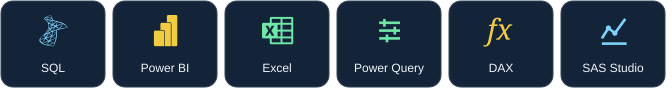

Data Analytics graduate · April 2026 · Asia Pacific University, Malaysia / De Montfort University, UK

### [Portfolio](https://amanzayn.netlify.app/)

Hi, I'm Aman. I work with SQL, Python, R, and Power BI to explore data, evaluate forecasts, and explain business performance. My projects cover tourism, retail, ecommerce, and database security.

I build analytical workflows from raw data to validated models and interactive dashboards, combining statistical rigor with clear business interpretation.

## Selected projects

## [Global Electronics — Sales & Profitability](https://github.com/AmanZayn7/global-electronics-powerbi-dashboard)

**3 report pages · 62,884 sales lines · 33 DAX measures**

A Power BI report connecting executive performance, product economics, and customer behavior. The analysis examines revenue changes, gross margins, repeat purchasing, and channel mix, with findings tied to specific years and filters.

`Power BI` `Power Query` `DAX` `Data modeling` `Sales analytics`

### [Download report](https://github.com/AmanZayn7/global-electronics-powerbi-dashboard/blob/main/global-electronics.pbix)

### [Asia Pacific Tourism Forecast](https://github.com/AmanZayn7/apac-tourism-fyp)

**3 market series · 7 candidates across 5 model families · 2015–2024 inputs**

My final-year tourism forecasting project covers Singapore, Hong Kong, and a Thailand series used as a Bangkok proxy. It uses chronological validation and a separate reporting holdout, and shows where simple baselines remain competitive. An interactive Streamlit dashboard presents the historical research results and forecasts.

`Python` `pandas` `scikit-learn` `XGBoost` `Streamlit` `Time series`

## [Explore Dashboard](https://apac-tourism.streamlit.app/)

### [Causyn — Ecommerce Analytics](https://github.com/AmanZayn7/Causyn)

**99,441 source orders · 9 source tables · 12 SQL validation checks**

An analytics application for exploring historical Olist ecommerce data through guided questions. It combines PostgreSQL reporting views with AI agents, numerical checks, and charts linked to source evidence. Recorded demos let visitors explore examples without making model requests.

`Python` `PostgreSQL` `SQL` `AI agents` `Docker`

## [Explore Platform](https://causyn.onrender.com/)

### [Medical Information System](https://github.com/AmanZayn7/medical-info-system-sqlserver)

**3 application roles · 3 temporal tables · 36 SQL Server integration checks**

A SQL Server project implementing role-based access, column-level encryption, audit logging, temporal tables, and backup and restore workflows. It explores how doctors, nurses, and patients can work with the same database under different permissions.

`SQL Server` `T-SQL` `Database security` `Access control`

[Test results](https://github.com/AmanZayn7/medical-info-system-sqlserver/actions/runs/37978584788)

## Skills

### Analysis and reporting

### Programming

### Data and modeling

### Development

## Certifications

- IBM — Data Analysis with Python
- Google — Foundations of Project Management
- SAS / Asia Pacific University — Professional Certificate of Achievement

More projects and background are available on my [portfolio](https://amanzayn.netlify.app/).
